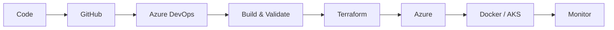

<!-- 🚀 Microsoft Azure DevOps Profile README | Priya Jaiswal -->

  

  

  
  
  
  

---

## 👋 About Me

I am **Priya Jaiswal**, an aspiring **Azure Cloud & DevOps Engineer** from Lucknow, India.

I work with **Microsoft Azure, Terraform, Azure DevOps, Docker, Kubernetes, Linux, Prometheus, and Grafana** to build automated, scalable, and reliable cloud infrastructure.

* ☁️ Building cloud infrastructure on **Microsoft Azure**
* 🏗️ Automating provisioning using **Terraform**
* ⚙️ Creating CI/CD workflows with **Azure DevOps**
* 🐳 Deploying containerized apps using **Docker & Kubernetes**
* 📊 Monitoring systems with **Prometheus & Grafana**
* 🎯 Open to **Azure Cloud / DevOps Engineer** opportunities

 

---

## 📈 Impact Metrics

  
  
  
  

| Metric                     | Result                                          |
| -------------------------- | ----------------------------------------------- |
| **Terraform Automation**   | Reduced manual infrastructure effort by **70%** |
| **Reusable IaC Modules**   | Standardized infrastructure setup               |
| **Azure DevOps Pipelines** | Automated build, validation & deployment        |
| **Docker Deployments**     | Consistent application releases                 |
| **Monitoring Setup**       | Real-time dashboards & alerting                 |

---

## 🧰 Tech Stack

  

---

## 🔄 DevOps Workflow

---

## 🚀 Featured Projects

<table>
<tr>
<td width="33%">

### 🚀 CI/CD Pipeline

**Azure DevOps · Terraform · Docker · NGINX**

Automated CI/CD workflows integrated with GitHub, Terraform provisioning, and Docker-based deployment on Linux servers.

</td>
<td width="33%">

### ☁️ Azure Infrastructure

**Terraform · Azure Storage · Azure Pipelines**

Reusable Terraform modules for Dev, Staging, and Production environments with remote backend and state locking.

</td>
<td width="33%">

### ☸️ AKS Deployment

**Azure AKS · Kubernetes · YAML · Git**

Provisioned AKS cluster using Terraform and created Kubernetes manifests for Pods and Deployments.

</td>
</tr>
</table>

---

## 📊 GitHub Analytics

  
  

  

---

## 📜 Certifications & Learning

* Microsoft Azure Fundamentals **AZ-900**
* Terraform Associate Learning Path
* Docker & Kubernetes Essentials
* Azure DevOps Fundamentals
* Linux Administration Basics

---

## 🎯 Current Focus

  
  
  
  

* ☁️ Azure Cloud Infrastructure
* ⚙️ Terraform Automation
* 🔁 Azure DevOps CI/CD
* ☸️ Kubernetes & Azure AKS
* 🔐 Cloud Security, RBAC & IAM

---

## 📄 Resume

  

---

## 🤝 Connect With Me

  
  

---

  <b>⭐ Open to Azure Cloud / DevOps Engineer Opportunities ⭐</b>

  

