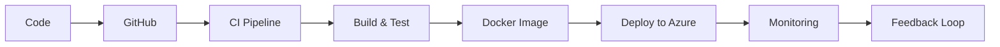

<!-- 🌈 Ultra Premium Animated Banner -->
<p align="center">
  
</p>

<!-- 🌟 Glowing Typing Animation -->
<p align="center">
  
</p>

<!-- 🔗 Social Links -->
<p align="center">
  <a href="https://linkedin.com/in/priya-jaiswal-0a2145369"></a>
  <a href="mailto:priyajaisw9554@gmail.com"></a>
  <a href="https://github.com/Pjaisw1103"></a>
</p>

<p align="center">
  
</p>

---

## 🧠 Engineer Snapshot

```yaml
name: Priya Jaiswal
role: Azure DevOps Engineer
focus: Cloud Automation & Infrastructure
experience: 1+ Year Internship

impact:
  - Deployment time ↓ 40%
  - Manual effort ↓ 60%
  - Built reusable Terraform modules

currently_learning:
  - Kubernetes (AKS)
  - GitOps (ArgoCD)
  - Monitoring (Grafana, Prometheus)
  - Azure Security (Key Vault, IAM)
```

---

## 🏆 Badges (Cloud & DevOps)

<p align="center">
  
  
  
  
  
</p>

---

## ⚙️ What I Do

- ☁️ Azure Infrastructure (VM, VMSS, VNet, NSG, LB)
- ⚙️ Terraform (Infrastructure as Code)
- 🔁 CI/CD (Azure DevOps + GitHub Actions)
- 📦 Docker Containerization
- 🔐 Azure Security (Key Vault, RBAC)
- 📊 Monitoring (Prometheus, Grafana, Azure Monitor)

---

## 🧰 Tech Stack

<p align="center">
  
</p>

---

## 🖼️ Project Screenshots (Portfolio Style)

### 🔹 CI/CD Pipeline Dashboard
<p align="center">
  
</p>

### 🔹 Terraform Infrastructure
<p align="center">
  
</p>

### 🔹 Monitoring Dashboard
<p align="center">
  
</p>

---

## 🔄 DevOps Workflow



---

## 💼 Experience

### 🔧 DevOps Intern — DevOps Insider
📅 Nov 2024 – Oct 2025

- Built CI/CD pipelines (Azure DevOps YAML)
- Automated infrastructure using Terraform
- Integrated Azure Key Vault
- Containerized apps using Docker
- Implemented monitoring (Prometheus + Grafana)

---

## 📊 GitHub Stats (Dark/Light Adaptive)

<p align="center">
  
</p>

<p align="center">
  
</p>

---

## 📈 Contribution Graph

<p align="center">
  
</p>

---

## 📄 Resume

<p align="center">
  <a href="https://github.com/Pjaisw1103/Pjaisw1103/blob/main/Resume.pdf">
    
  </a>
</p>

---

## 🎯 Current Focus

- Kubernetes (AKS)
- GitOps (ArgoCD)
- Cloud Security & IAM

---

## 💬 DevOps Philosophy

> "Automate everything. Build scalable systems. Deliver with confidence."

---

<p align="center">
  ⭐ Open to DevOps / Cloud Engineer Opportunities
</p>
