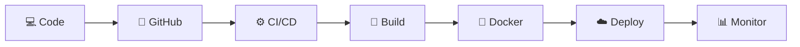

<!-- 🌈 Ultimate Premium DevOps Profile -->

  

<!-- ⚡ Neon Typing Animation -->

  

<!-- 🌐 Socials -->

  
  
  

  

---

## 🧠 💡 About Me

💻 Azure DevOps Engineer with **1+ year internship experience** in building scalable cloud infrastructure & automating CI/CD pipelines.

✨ **Impact:**
- 🚀 Deployment time improved by **40%**
- ⚡ Manual effort reduced by **60%**

---

## 🏆 🚀 DevOps Badges

  
  
  
  
  

---

## ⚙️ 🛠️ Technical Skills

🔹 **Cloud:** Azure (VM, VMSS, VNet, NSG, LB, App Gateway)  
🔹 **IaC:** Terraform  
🔹 **CI/CD:** Azure DevOps (YAML), GitHub Actions  
🔹 **Containers:** Docker, Kubernetes (Basics)  
🔹 **Security:** Key Vault, RBAC  
🔹 **Monitoring:** Prometheus, Grafana, Azure Monitor  
🔹 **Languages:** Python, Bash, YAML  

---

## 🔄 ⚡ DevOps Workflow

---

## 💼 👩‍💻 Experience

### 🚀 DevOps Engineer Intern
📅 Nov 2024 – Oct 2025

- ⚙️ Built CI/CD pipelines using Azure DevOps (YAML)
- ☁️ Provisioned infrastructure using Terraform
- 🔐 Integrated Azure Key Vault
- 🐳 Containerized apps using Docker
- 📊 Monitoring with Prometheus & Grafana

---

## 🚀 💡 Projects

### 🔹 CI/CD Pipeline
- Multi-stage Azure DevOps pipeline
- SonarQube integration
- Docker deployment

### 🔹 Terraform Automation
- Reusable infrastructure modules
- Automated provisioning

### 🔹 Monitoring Setup
- Grafana dashboards + Prometheus alerts

---

## 📊 📈 GitHub Dashboard

  
  

  

---

## 📄 🎯 Resume

  

---

## 🎯 🔥 Current Focus

- ☸️ Kubernetes (AKS)
- 🔄 GitOps (ArgoCD)
- 🔐 Cloud Security & IAM

---

## 💬 ✨ DevOps Philosophy

> 🚀 Automate everything. Build scalable systems. Deliver with confidence.

---

  ⭐ <b>Open to DevOps / Cloud Opportunities</b>

