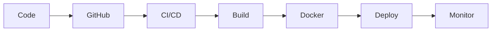

<!-- 🌈 Premium Animated Banner -->

  

<!-- ⚡ Typing Animation -->

  

  
  
  

---

## 🧠 Summary

Azure DevOps Engineer with 1+ year of hands-on internship experience in building scalable cloud infrastructure and automating CI/CD pipelines on Microsoft Azure.

✔ Deployment time improved by **40%**  
✔ Manual effort reduced by **60%**

---

## 🏆 Tech Badges

  
  
  
  
  

---

## ⚙️ Technical Skills

**Cloud:** Azure (VM, VMSS, VNet, NSG, Load Balancer, App Gateway)  
**IaC:** Terraform  
**CI/CD:** Azure DevOps (YAML), GitHub Actions  
**Containers:** Docker, Kubernetes (Basics)  
**Security:** Key Vault, RBAC  
**Monitoring:** Prometheus, Grafana, Azure Monitor  
**Languages:** Python, Bash, YAML  

---

## 🔄 DevOps Workflow

---

## 💼 Experience

### DevOps Engineer Intern
📅 Nov 2024 – Oct 2025

- Built CI/CD pipelines using Azure DevOps (YAML)
- Provisioned infrastructure using Terraform
- Integrated Azure Key Vault
- Used Docker for deployments
- Monitoring with Prometheus & Grafana

---

## 🚀 Projects

### 🔹 CI/CD Pipeline
- Multi-stage Azure DevOps pipeline
- SonarQube integration
- Docker-based deployment

### 🔹 Terraform Automation
- Created reusable infrastructure modules
- Automated infra provisioning

### 🔹 Monitoring Setup
- Grafana dashboards + Prometheus alerts

---

## 📊 GitHub Dashboard

  
  

  

---

## 📄 Resume

  

---

  ⭐ Open to DevOps / Cloud Opportunities

