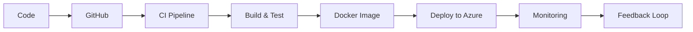

<!-- 🌟 Premium DevOps GitHub Profile README -->

<h1 align="center">Hi 👋, I'm Priya Jaiswal</h1>
<h3 align="center">🚀 Azure DevOps Engineer | Cloud & Automation Enthusiast</h3>

  
  
  

  

---

## 🧠 About Me

💡 Azure DevOps Engineer with 1+ year of hands-on internship experience in building scalable cloud infrastructure and automating CI/CD pipelines.

✔ Reduced deployment time by **40%**  
✔ Reduced manual effort by **60%**  
✔ Strong in **Terraform, Azure DevOps, Docker**

---

## 🚀 What I Do

- ☁️ Design & manage Azure infrastructure (VM, VMSS, VNet, NSG, Load Balancer)
- ⚙️ Automate infrastructure using Terraform (IaC)
- 🔁 Build CI/CD pipelines using Azure DevOps & GitHub Actions
- 📦 Containerize applications using Docker
- 🔐 Secure apps using Azure Key Vault & RBAC
- 📊 Monitoring with Prometheus, Grafana & Azure Monitor

---

## 🛠️ Tech Stack

  

---

## 🔄 DevOps Workflow

---

## 💼 Experience

### 🔧 DevOps Intern — DevOps Insider  
📅 Nov 2024 – Oct 2025

- Built CI/CD pipelines with Azure DevOps (YAML)
- Automated Azure infrastructure using Terraform
- Implemented remote backend using Azure Storage
- Integrated Azure Key Vault for secrets
- Used Docker for containerized deployments
- Implemented monitoring using Prometheus & Grafana

---

## 🚀 Projects

### 🔹 CI/CD Pipeline (Node.js App)
- Automated build, test, deploy pipeline
- Integrated Docker & SonarQube
- Multi-environment deployment (Dev/Test/Prod)

### 🔹 Terraform Infrastructure Automation
- Modular infra (VM, VNet, NSG, Load Balancer)
- Automated provisioning via pipelines
- Monitoring integration included

### 🔹 Monitoring System
- Grafana dashboards
- Prometheus alerts
- Azure Monitor integration

---

## 📊 GitHub Stats

  
  

---

## 📈 Contribution Graph

  

---

## 📄 Resume

  

---

## 🎯 Current Focus

- Kubernetes (AKS)
- GitOps (ArgoCD)
- Cloud Security & IAM
- Advanced CI/CD Pipelines

---

## 💬 DevOps Philosophy

> Automate everything. Build scalable systems. Deliver with confidence.

---

  ⭐ Open to DevOps / Cloud Engineer Opportunities

