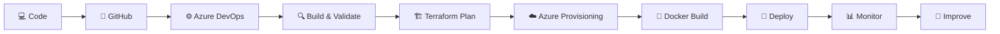

<!-- 🚀 Microsoft Azure DevOps Profile README | Priya Jaiswal -->

  

  

  
  
  
  

---

## 👋 About Me

I am **Priya Jaiswal**, an aspiring **Azure Cloud & DevOps Engineer** from Lucknow, India.

I work with **Microsoft Azure, Terraform, Azure DevOps, Docker, Kubernetes, Linux, Prometheus, and Grafana** to build automated, scalable, and reliable cloud infrastructure.

* ☁️ Building cloud infrastructure on **Microsoft Azure**
* 🏗️ Automating provisioning using **Terraform**
* ⚙️ Creating CI/CD workflows with **Azure DevOps**
* 🐳 Deploying containerized apps using **Docker & Kubernetes**
* 📊 Monitoring systems with **Prometheus & Grafana**
* 🎯 Open to **Azure Cloud / DevOps Engineer** opportunities

 

---

## 📈 Impact Metrics

  
  
  
  

| Area                          | Work Done                                             | Result                            |
| ----------------------------- | ----------------------------------------------------- | --------------------------------- |
| **Infrastructure Automation** | Automated Azure resource provisioning using Terraform | Reduced manual effort by **70%**  |
| **CI/CD Automation**          | Built Azure DevOps YAML pipelines                     | Improved deployment consistency   |
| **Reusable IaC**              | Created Terraform modules                             | Standardized infrastructure setup |
| **Containerization**          | Dockerized applications                               | Consistent runtime environments   |
| **Monitoring**                | Configured Prometheus & Grafana                       | Better visibility and alerting    |
| **Troubleshooting**           | Resolved pipeline, deployment, and Linux issues       | Improved system reliability       |

---

## 🧰 Tech Stack

  

---

## ⚙️ Skills Matrix

| Category                       | Tools & Technologies                                                     |
| ------------------------------ | ------------------------------------------------------------------------ |
| ☁️ **Cloud Platform**          | Microsoft Azure, VM, VMSS, VNet, NSG, Load Balancer, Application Gateway |
| 🏗️ **Infrastructure as Code** | Terraform, Terraform Modules, Azure Storage Backend                      |
| 🔁 **CI/CD**                   | Azure DevOps Pipelines, YAML Pipelines, GitHub Actions                   |
| 🐳 **Containers**              | Docker, Kubernetes, Azure AKS                                            |
| 📊 **Monitoring**              | Prometheus, Grafana, Azure Monitor                                       |
| 🔐 **Security Basics**         | RBAC, Key Vault, Secure State Management                                 |
| 💻 **Operating Systems**       | Linux Ubuntu, Windows                                                    |
| 🧑‍💻 **Scripting**            | Bash, Python, YAML                                                       |
| 🌐 **Web Server**              | NGINX                                                                    |
| 🧩 **Version Control**         | Git, GitHub                                                              |

---

## 🔄 DevOps Workflow

---

## 💼 Experience

### 🚀 DevOps Engineer Intern

**DevOps Insiders**
📍 Remote, India
📅 **November 2024 – October 2025**

* Automated Azure infrastructure provisioning using **Terraform**.
* Designed and maintained automated **CI/CD workflows** using Azure DevOps pipelines.
* Containerized applications with **Docker** for consistent deployments.
* Configured infrastructure monitoring and real-time alerting using **Prometheus and Grafana**.
* Standardized infrastructure setups using reusable **Terraform modules**.
* Troubleshot and resolved pipeline failures, deployment bugs, and Linux server issues.

---

## 🚀 Featured Projects

<table>
<tr>
<td width="50%">

### 🚀 CI/CD Deployment Automation Pipeline

**Tech Stack:** Azure DevOps, Terraform, Docker, Linux, NGINX

* Designed automated CI/CD workflows using Azure DevOps.
* Integrated GitHub repositories with Azure DevOps.
* Automated Azure infrastructure provisioning using Terraform.
* Reduced manual infrastructure effort by **70%**.
* Deployed Dockerized applications on Linux servers with NGINX.

</td>
<td width="50%">

### ☁️ Multi-Environment Azure Infrastructure

**Tech Stack:** Terraform, Azure, Azure DevOps, Azure Storage

* Developed reusable Terraform modules.
* Standardized Dev, Staging, and Production environments.
* Configured Azure Storage backend with state locking.
* Automated infrastructure validation and deployment workflows.
* Improved cloud infrastructure reliability.

</td>
</tr>

<tr>
<td width="50%">

### ☸️ Azure AKS Provisioning & Deployment

**Tech Stack:** Terraform, Azure AKS, Kubernetes, YAML, Git

* Provisioned Azure AKS cluster using Terraform.
* Created Kubernetes YAML manifests.
* Practiced Pods and Deployments.
* Managed Terraform and Kubernetes configurations using Git.
* Gained hands-on Kubernetes orchestration experience.

</td>
<td width="50%">

### 📊 Monitoring & Alerting Setup

**Tech Stack:** Prometheus, Grafana, Azure Monitor, Linux

* Configured monitoring dashboards.
* Set up real-time infrastructure alerts.
* Improved troubleshooting visibility.
* Practiced observability workflows.
* Monitored cloud and containerized environments.

</td>
</tr>
</table>

---

## 🎓 Education

### 🎓 B.Tech in Computer Science and Engineering

**Dr. A.P.J Abdul Kalam Technical University**
📍 Lucknow, Uttar Pradesh, India
📅 September 2022 – April 2026
**CGPA:** 8.4 / 10

### 🏫 Jawahar Navodaya Vidyalaya, Balrampur CBSE

📍 Uttar Pradesh, India
**Intermediate PCM:** 84.4%
**High School:** 84.6%

---

## 📊 GitHub Analytics

  
  

  

  

---

## 🐍 Contribution Snake

  

---

## 📜 Certifications & Learning

* Microsoft Azure Fundamentals **AZ-900**
* Terraform Associate Learning Path
* Docker & Kubernetes Essentials
* Azure DevOps Fundamentals
* Linux Administration Basics

---

## 🎯 Current Focus

  
  
  
  

* ☁️ Azure Cloud Infrastructure
* ⚙️ Terraform Automation
* 🔁 Azure DevOps CI/CD
* ☸️ Kubernetes & Azure AKS
* 🔐 Cloud Security, RBAC & IAM
* 📊 Monitoring and Observability

---

## 📄 Resume

  

---

## 🤝 Connect With Me

  
  

---

## 💬 DevOps Philosophy

  

---

  <b>⭐ Open to Azure Cloud / DevOps Engineer Opportunities ⭐</b>

  

