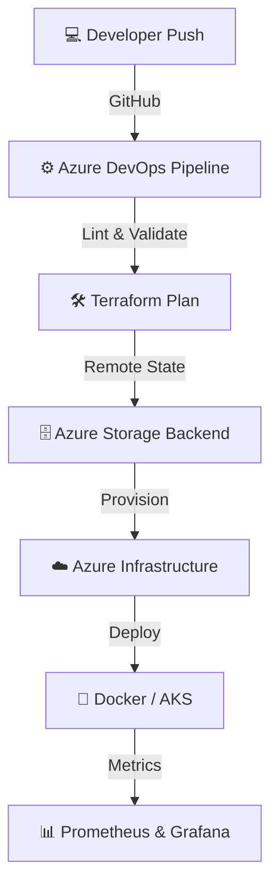

# ✨ Priya Jaiswal ✨

  

  

  
  
  

  

---

# 🧠 About Me

Aspiring **Azure Cloud & DevOps Engineer** with hands-on internship experience in cloud automation, infrastructure provisioning, CI/CD implementation, and containerized deployments.

I enjoy building scalable cloud architectures, automating infrastructure, and improving software delivery pipelines using modern DevOps practices.

---

# ⚡ Engineering Impact

| Metric                  | Achievement          | Impact                                    |
| ----------------------- | -------------------- | ----------------------------------------- |
| 📉 Manual Effort        | Reduced by **70%**   | Through end-to-end Terraform automation   |
| 🔄 Environment Parity   | **100% Reusable**    | Modular IaC for Dev, Staging & Production |
| ⚙️ Pipeline Reliability | Automated Validation | State locking & deployment consistency    |

---

# 🏆 Tech Stack

  
  
  
  
  
  

---

# ⚙️ Technical Skills

### ☁️ Cloud Platform

* Microsoft Azure

  * Virtual Machines (VM)
  * VM Scale Sets (VMSS)
  * Virtual Networks (VNet)
  * Network Security Groups (NSG)
  * Load Balancer
  * Application Gateway
  * Azure Storage

### 🏗 Infrastructure as Code

* Terraform
* Reusable Terraform Modules
* Remote State Management

### 🚀 CI/CD Automation

* Azure DevOps Pipelines
* YAML Pipelines
* GitHub Actions

### 🐳 Containers & Orchestration

* Docker
* Kubernetes
* Azure Kubernetes Service (AKS)

### 📊 Monitoring & Observability

* Prometheus
* Grafana
* Azure Monitor

### 💻 Operating Systems & Tools

* Linux (Ubuntu)
* Git
* GitHub
* NGINX

### 🔧 Scripting & Configuration

* Bash
* Python
* YAML

---

# 🔄 GitOps & CI/CD Workflow

---

# 💼 Experience

## DevOps Engineer Intern

**DevOps Insiders**
📅 November 2024 – October 2025
📍 Remote, India

### Key Contributions

* Automated Azure infrastructure provisioning using reusable Terraform modules.
* Standardized cloud environments across teams.
* Designed and maintained Azure DevOps CI/CD pipelines.
* Containerized applications using Docker.
* Built monitoring dashboards with Prometheus and Grafana.
* Resolved deployment issues, Linux server problems, and pipeline failures.

---

# 🚀 Featured Projects

## 🛠 CI/CD Deployment Automation Pipeline

**Tech Stack:** Azure DevOps, Terraform, Docker, Linux, NGINX

* Developed end-to-end CI/CD pipelines integrated with GitHub.
* Automated infrastructure provisioning through Terraform.
* Reduced manual deployment efforts by 70%.
* Containerized applications and deployed through Linux servers with NGINX.

---

## 📐 Multi-Environment Azure Infrastructure Setup

**Tech Stack:** Terraform, Azure Storage, Azure Pipelines

* Designed reusable Terraform modules.
* Created Dev, Staging, and Production environments.
* Configured Azure Storage backend for remote state management.
* Enabled safe concurrent Terraform execution.

---

## ☸️ Azure AKS Provisioning & Deployment Cluster

**Tech Stack:** Azure AKS, Kubernetes, Terraform, YAML

* Provisioned AKS clusters using Terraform.
* Created Kubernetes Deployment, Service, and Pod manifests.
* Implemented scalable deployment architecture.

---

# 🎓 Education

## B.Tech – Computer Science & Engineering

**Dr. A.P.J Abdul Kalam Technical University**

🎓 CGPA: **8.4 / 10**
📅 Graduation: April 2026

---

## Intermediate & High School (PCM)

**Jawahar Navodaya Vidyalaya, Balrampur (CBSE)**

📚 Intermediate: **84.4%**
📚 High School: **84.6%**

---

# 🎯 Current Focus

* ☸️ Advanced Kubernetes & AKS Architectures
* 🔄 GitOps using ArgoCD & Flux
* 🔐 Cloud Security & RBAC Governance
* 🚀 Scalable Infrastructure Automation
* 📈 Site Reliability Engineering (SRE)

---

# 📈 GitHub Stats

  

  

  

---

# 🏅 Certifications

* Microsoft Azure Fundamentals (AZ-900)
* Terraform Associate (Learning Path)
* Azure DevOps Fundamentals
* Docker & Kubernetes Essentials

---

# 💬 DevOps Philosophy

> 🚀 Automate everything.
> ⚙️ Build scalable systems.
> 🔐 Secure by design.
> 📦 Deliver with confidence.
> ☁️ Cloud is not infrastructure, it's innovation.

---

  ⭐ If you like my work, consider giving a star to my repositories!

