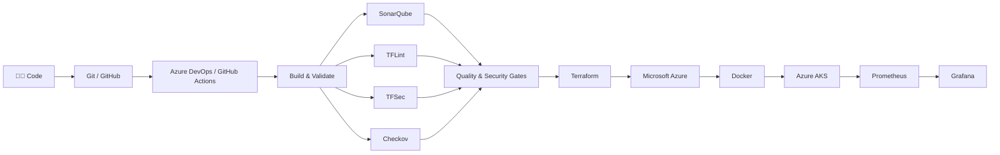

<!-- 🚀 Microsoft Azure DevOps Profile README | Priya Jaiswal -->

  

  

  
  
  
  

---

# 👋 About Me

I am **Priya Jaiswal**, an **Azure Cloud, DevOps & DevSecOps Engineer** passionate about building automated, resilient, and security-first cloud operations.

I leverage **Microsoft Azure, Terraform, Azure DevOps, Kubernetes (AKS), DevSecOps tools, and Observability stacks** to design scalable enterprise solutions.

- ☁️ **Cloud Architecture:** Provisioning scalable & reliable infrastructure on **Microsoft Azure**
- 🏗️ **Infrastructure as Code:** Automating provisioning with **Terraform** ensuring 100% environment consistency
- ⚙️ **CI/CD Pipelines:** Designing automated deployment workflows using **Azure DevOps & GitHub Actions**
- 🔐 **Shift-Left Security:** Enforcing security gates using **SonarQube, TFSec, TFLint & Checkov**
- 🐳 **Containerization:** Packaging microservices using **Docker** with optimized multi-stage builds
- ☸️ **Orchestration:** Deploying and managing containerized workloads on **Kubernetes & Azure AKS**
- 📊 **Observability:** Setting up real-time monitoring & alerting using **Prometheus & Grafana**
- 🐧 **Linux Automation:** Streamlining system operations & maintenance using **Bash & Python**
- 🎯 Open to **Azure Cloud / DevOps / DevSecOps Engineer** opportunities

---

# 📈 Impact & Experience

| Area | Impact |
| ------------------------- | ---------------------------------------------- |
| **Terraform Automation** | Provisioned scalable Azure infrastructure using modular IaC, reducing manual setup overhead |
| **Infrastructure Consistency** | Enforced 100% environment consistency across Dev, Staging & Production with remote state locking |
| **CI/CD Automation** | Designed zero-touch Azure DevOps & GitHub Actions pipelines for automated validation & deployment |
| **DevSecOps Integration** | Shifted security left by embedding SonarQube, TFSec, TFLint & Checkov to catch vulnerabilities pre-deployment |
| **Containerization** | Reduced image footprints & build times using optimized Docker multi-stage builds |
| **Kubernetes Deployment** | Orchestrated microservices on Azure AKS with declarative YAML manifests, resource limits & network rules |
| **Monitoring & Observability** | Built real-time Prometheus & Grafana dashboards for continuous AKS health & system metric tracking |
| **Linux Automation** | Authored custom Bash & Python scripts to streamline system maintenance, troubleshooting, and deployments |

---

# 🧰 Tech Stack

| Category                          | Technologies                              |
| --------------------------------- | ----------------------------------------- |
| ☁️ **Cloud**                      | Microsoft Azure                            |
| 🏗️ **Infrastructure as Code**    | Terraform                                  |
| ⚙️ **CI/CD & Automation**         | Azure DevOps · GitHub Actions · Git        |
| 🔐 **DevSecOps & Code Quality**   | SonarQube · TFSec · TFLint · Checkov       |
| 🐳 **Containers & Orchestration** | Docker · Kubernetes · Azure AKS             |
| 📊 **Monitoring & Observability** | Prometheus · Grafana                       |
| 🐧 **OS & Scripting**             | Linux · Ubuntu · Bash · Python             |

---

# 🔄 DevSecOps Workflow

```mermaid
flowchart LR
    A["👩‍💻 Code"] --> B["Git / GitHub"]
    B --> C["Azure DevOps / GitHub Actions"]
    C --> D["Build & Validate"]

    D --> E["SonarQube"]
    D --> F["TFLint"]
    D --> G["TFSec"]
    D --> H["Checkov"]

    E --> I["Quality & Security Gates"]
    F --> I
    G --> I
    H --> I

    I --> J["Terraform"]
    J --> K["Microsoft Azure"]

    K --> L["Docker"]
    L --> M["Azure AKS"]

    M --> N["Prometheus"]
    N --> O["Grafana"]
```

---

## 🚀 Featured Projects

### 🚀 CI/CD Pipeline with Code Quality & Security Scanning

**Azure DevOps · SonarQube · Checkov · Docker · NGINX**

Built an automated **Azure DevOps CI/CD pipeline** for application deployment with integrated code quality and Infrastructure-as-Code security checks.

- ⚙️ Automated application deployment through **Azure DevOps CI/CD**
- 🔍 Integrated **SonarQube** for static code analysis
- 🔐 Added **Checkov** for IaC security scanning
- 🐳 Containerized web applications using **Docker**
- 🌐 Deployed containerized applications with **NGINX on Linux nodes**

🔗 **[View Project →]([YOUR_PROJECT_LINK](https://github.com/Pjaisw1103/CICD-Deployment-Automation-Pipeline.git))**

---

### ☁️ Multi-Environment Infrastructure Automation

**Terraform · Azure Storage · TFSec · TFLint**

Built reusable **Terraform modules** to provision isolated **Dev, Staging, and Production** environments on Microsoft Azure.

- 🏗️ Developed reusable **Terraform modules** for environment provisioning
- 🌍 Managed separate **Dev, Staging & Production** environments
- 🔐 Integrated **TFSec** to identify IaC security issues
- 🧹 Used **TFLint** for Terraform code quality and standards
- ☁️ Configured **Azure Blob Storage** for remote Terraform state
- 🔒 Implemented **state locking** for secure team workflows

🔗 **[View Project →]([YOUR_PROJECT_LINK](https://github.com/Pjaisw1103/Multi-Environment-Azure-Infrastructure-Setup.git))**

---

### ☸️ Azure AKS Cluster Provisioning & Deployment

**Azure AKS · Kubernetes · Terraform · Docker · YAML · Git**

Provisioned **Azure Kubernetes Service (AKS)** using modular Terraform scripts and deployed applications using declarative Kubernetes configurations.

- ☸️ Provisioned **AKS infrastructure** using Terraform
- 📄 Created Kubernetes **YAML manifests**
- 🚀 Managed application **Deployments & Services**
- 🐳 Deployed **Docker-based containerized workloads**
- ⚙️ Configured pod **resource limits & environment variables**
- 🌐 Worked with **Kubernetes cluster networking**

🔗 **[View Project →][(YOUR_PROJECT_LINK](https://github.com/Pjaisw1103/Azure-AKS-Provisioning-and-Deployment.git))**

---

## 📊 GitHub Analytics

  
  

---

## 🎯 Current Focus

- ☁️ **Azure Cloud & Infrastructure**
- 🏗️ **Terraform & Infrastructure as Code**
- ⚙️ **Azure DevOps & GitHub Actions CI/CD**
- 🔐 **DevSecOps & Shift-Left Security**
- ☸️ **Kubernetes & Azure AKS**
- 🐳 **Docker & Containerization**
- 📊 **Prometheus & Grafana Monitoring**
- 🐧 **Linux & Bash Automation**

---

## 📄 Resume

  

---

## 🤝 Connect With Me

  
  

---

  <b>💼 Open to Azure Cloud | DevOps | DevSecOps Opportunities</b>

  

