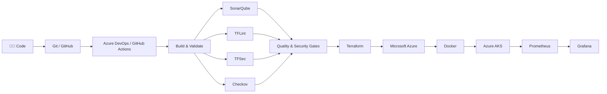

<!-- 🚀 Microsoft Azure DevOps Profile README | Priya Jaiswal -->

  

  

  
  
  
  

---

# 👋 About Me

I am **Priya Jaiswal**, an aspiring **Azure Cloud, DevOps & DevSecOps Engineer**.

I work with **Microsoft Azure, Terraform, Azure DevOps, GitHub Actions, Docker, Kubernetes (AKS), Linux, SonarQube, TFSec, TFLint, Checkov, Prometheus, and Grafana** to build automated, secure, scalable, and reliable cloud infrastructure.

- ☁️ Building cloud infrastructure on **Microsoft Azure**
- 🏗️ Automating infrastructure provisioning using **Terraform**
- ⚙️ Creating CI/CD workflows with **Azure DevOps & GitHub Actions**
- 🔐 Implementing **DevSecOps** using SonarQube, TFSec, TFLint & Checkov
- 🐳 Containerizing applications using **Docker**
- ☸️ Deploying workloads using **Kubernetes & Azure AKS**
- 📊 Monitoring infrastructure and applications with **Prometheus & Grafana**
- 🐧 Automating Linux operations using **Bash & Python**
- 🎯 Open to **Azure Cloud / DevOps / DevSecOps Engineer** opportunities

---

# 📈 Impact & Experience

| Area | Impact |
| ------------------------- | ---------------------------------------------- |
| **Terraform Automation** | Provisioned scalable Azure infrastructure using reusable modules |
| **Infrastructure Consistency** | Achieved consistent environments using modular IaC |
| **CI/CD Automation** | Automated build, validation & deployment workflows |
| **DevSecOps Integration** | Integrated SonarQube, TFSec, TFLint & Checkov into pipelines |
| **Containerization** | Optimized Docker images using multi-stage builds |
| **Kubernetes Deployment** | Deployed containerized workloads on Azure AKS |
| **Monitoring & Observability** | Built Prometheus & Grafana dashboards for AKS and system metrics |
| **Linux Automation** | Automated routine server maintenance and deployment tasks |

---

# 🧰 Tech Stack

| Category | Technologies |
|----------|--------------|
| ☁️ **Cloud** | Azure |
| 🏗️ **Infrastructure as Code** | Terraform |
| ⚙️ **CI/CD & Automation** | Azure DevOps · GitHub Actions · Git |
| 🔐 **DevSecOps** | SonarQube · TFSec · TFLint · Checkov |
| 🐳 **Containers & Orchestration** | Docker · Kubernetes · AKS |
| 📊 **Monitoring** | Prometheus · Grafana |
| 🐧 **OS & Scripting** | Linux · Ubuntu · Bash · Python |

---

# 🔄 DevSecOps Workflow

```mermaid
flowchart LR
    A["👩‍💻 Code"] --> B["Git / GitHub"]
    B --> C["Azure DevOps / GitHub Actions"]
    C --> D["Build & Validate"]

    D --> E["SonarQube"]
    D --> F["TFLint"]
    D --> G["TFSec"]
    D --> H["Checkov"]

    E --> I["Quality & Security Gates"]
    F --> I
    G --> I
    H --> I

    I --> J["Terraform"]
    J --> K["Microsoft Azure"]

    K --> L["Docker"]
    L --> M["Azure AKS"]

    M --> N["Prometheus"]
    N --> O["Grafana"]
```

---

## 🚀 Featured Projects

### 🚀 CI/CD Pipeline with Code Quality & Security Scanning

**Azure DevOps · SonarQube · Checkov · Docker · NGINX**

Engineered an automated **Azure DevOps CI/CD pipeline** for seamless application deployments with integrated code quality and Infrastructure-as-Code security scanning.

- ⚙️ Automated application deployment using **Azure DevOps**
- 🔍 Integrated **SonarQube** for static code analysis
- 🔐 Integrated **Checkov** for automated IaC security scanning
- 🐳 Containerized web applications using **Docker**
- 🌐 Deployed applications using **NGINX on Linux nodes**

🔗 **[View Project →](YOUR_PROJECT_LINK)**

---

### ☁️ Multi-Environment Infrastructure Automation

**Terraform · Azure Storage · TFSec · TFLint**

Developed reusable **Terraform modules** to provision isolated **Dev, Staging, and Production** environments on Microsoft Azure.

- 🏗️ Created reusable **Terraform modules** for environment provisioning
- 🌍 Managed isolated **Dev, Staging & Production** environments
- 🔐 Integrated **TFSec** for Infrastructure-as-Code security analysis
- 🧹 Integrated **TFLint** for Terraform code quality and standards
- ☁️ Configured **Azure Blob Storage** for remote Terraform state
- 🔒 Implemented **state locking** for secure team workflows

🔗 **[View Project →](YOUR_PROJECT_LINK)**

---

### ☸️ Azure AKS Cluster Provisioning & Deployment

**Azure AKS · Kubernetes · Terraform · Docker · YAML · Git**

Provisioned **Azure Kubernetes Service (AKS)** clusters using modular Terraform scripts and deployed workloads using declarative Kubernetes configurations.

- ☸️ Provisioned **AKS clusters** using modular Terraform
- 📄 Created declarative **Kubernetes YAML manifests**
- 🚀 Configured Kubernetes **Deployments & Services**
- 🐳 Worked with **Docker-based containerized workloads**
- ⚙️ Configured pod **resource limits and environment variables**
- 🌐 Configured **Kubernetes cluster networking workflows**

🔗 **[View Project →](YOUR_PROJECT_LINK)**

---

## 📊 GitHub Analytics

  
  
  

  

---

## 🎯 Current Focus

  
  
  
  

* ☁️ Azure Cloud Infrastructure
* ⚙️ Terraform Automation
* 🔁 Azure DevOps CI/CD
* ☸️ Kubernetes & Azure AKS
* 🔐 Cloud Security, RBAC & IAM

---

## 📄 Resume

  

---

## 🤝 Connect With Me

  
  

---

  <b>⭐ Open to Azure Cloud / DevOps Engineer Opportunities ⭐</b>

  

