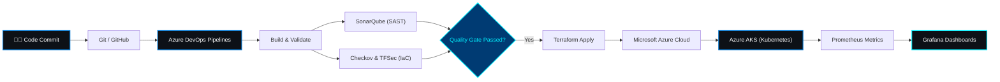

<!-- 🚀 Microsoft Azure DevOps & DevSecOps Profile README | Priya Jaiswal -->

  

  

  
  
  
  
  

---

## 👋 About Me

I am **Priya Jaiswal**, an **Azure Cloud, DevOps & DevSecOps Engineer** dedicated to architecting automated, secure, and resilient cloud infrastructure.

With **1 year of hands-on internship experience at DevOps Insiders**, I specialize in provisioning enterprise cloud resources using **Terraform IaC**, building zero-touch **Azure DevOps CI/CD pipelines**, orchestrating **Azure AKS Kubernetes** clusters, and integrating **shift-left security tools**.

### 🛠️ Core Engineering Focus
- ☁️ **Azure Cloud Architecture:** Provisioning scalable Azure cloud infrastructure (VNets, VMs, AKS, Key Vault, Storage).
- 🏗️ **Infrastructure as Code:** Writing modular **Terraform** HCL with Azure Blob state locking for 100% environment consistency.
- ⚙️ **CI/CD Automation:** Designing automated build & deployment workflows in **Azure DevOps & GitHub Actions**.
- 🔐 **Shift-Left Security:** Enforcing security gates using **SonarQube, TFSec, TFLint & Checkov**.
- 🐳 **Containers & K8s:** Microservices containerization with **Docker** and deployment on **Azure AKS**.
- 📊 **Observability:** Real-time cluster health & system metric monitoring using **Prometheus & Grafana**.
- ⚡ **Availability:** **Immediate Joiner (0 Days Notice)** | B.Tech CSE (8.43 CGPA / 10).

 

---

## 🌐 Interactive Portfolio Spotlight

  

Explore my **interactive DevOps portfolio website** featuring:
- ⚡ **Live CI/CD & DevSecOps Pipeline Simulator**: Clickable multi-stage pipeline runner with real-time log inspector.
- 💻 **Interactive CLI Command Bar**: Typewriter terminal with quick runnable DevOps commands (`$ terraform plan`, `$ kubectl get pods`, `$ checkov scan`).
- 📋 **Recruiter Corner**: Fast-track qualifications summary and verified official PDF resume download.
- 🔍 **Architecture Topology Specs**: Visual infrastructure flow specs for cloud projects.

👉 **Direct Link**: [**pjaisw1103.github.io/priyajaiswal.github.io**](https://pjaisw1103.github.io/priyajaiswal.github.io/)

---

## 🧰 Tech Stack

| Category | Technologies |
| :--- | :--- |
| ☁️ **Cloud & Infrastructure** | Microsoft Azure · Azure AKS · Azure Key Vault · Azure Blob Storage · VNets |
| 🏗️ **Infrastructure as Code** | Terraform · HCL Modules · Remote State Locking · TFSec · TFLint · Checkov |
| ⚙️ **CI/CD & DevSecOps** | Azure DevOps Pipelines · GitHub Actions · Git · SonarQube · Checkov |
| 🐳 **Containers & Orchestration** | Docker · Kubernetes · Azure AKS · NGINX |
| 📊 **Monitoring & Observability** | Prometheus · Grafana · System Alerts |
| 🐧 **OS & Scripting** | Linux (Ubuntu) · Bash Shell Scripting · Python · Git |

---

## 📈 Experience & Engineering Impact

| Area | Engineering Impact | Key Stack |
| :--- | :--- | :--- |
| **Terraform Automation** | Built modular Azure HCL scripts with Blob remote state locking, ensuring 100% environment consistency across Dev, Staging & Production. | `Terraform` · `Azure Storage` |
| **CI/CD Automation** | Engineered zero-touch Azure DevOps & GitHub Actions release pipelines for automated code building, security scanning, and deployment. | `Azure DevOps` · `YAML` |
| **Shift-Left Security** | Integrated SonarQube static code analysis and Checkov/TFSec IaC scanners into pipeline quality gates to catch security risks pre-deployment. | `SonarQube` · `Checkov` · `TFSec` |
| **AKS Kubernetes Deployment** | Orchestrated containerized microservices on Azure AKS clusters with declarative YAML manifests, pod resource limits, and service networking. | `Docker` · `Azure AKS` · `K8s` |
| **Observability** | Configured Prometheus metric scraping and built real-time Grafana dashboards for cluster CPU, memory, and pod health tracking. | `Prometheus` · `Grafana` |

---

## 🔄 DevSecOps Architecture Workflow

```mermaid
flowchart LR
    A["👩‍💻 Code Commit"] --> B["Git / GitHub"]
    B --> C["Azure DevOps Pipelines"]
    C --> D["Build & Validate"]

    D --> E["SonarQube (SAST)"]
    D --> F["Checkov & TFSec (IaC)"]

    E --> G{"Quality Gate Passed?"}
    F --> G

    G -- Yes --> H["Terraform Apply"]
    H --> I["Microsoft Azure Cloud"]

    I --> J["Azure AKS (Kubernetes)"]

    J --> K["Prometheus Metrics"]
    K --> L["Grafana Dashboards"]

    style A fill:#0d1117,stroke:#0078d4,stroke-width:2px,color:#fff
    style C fill:#0d1117,stroke:#0078d4,stroke-width:2px,color:#fff
    style G fill:#003b73,stroke:#00f0ff,stroke-width:2px,color:#00f0ff
    style J fill:#0d1117,stroke:#0078d4,stroke-width:2px,color:#fff
    style L fill:#0d1117,stroke:#00f0ff,stroke-width:2px,color:#fff
```

---

## 🚀 Featured Infrastructure Projects

### 1️⃣ [CI/CD Pipeline with Code Quality & Security Scanning](https://github.com/Pjaisw1103/CICD-Deployment-Automation-Pipeline)
> **Azure DevOps · SonarQube · Checkov · Docker · NGINX · Linux**

- Built an automated **Azure DevOps CI/CD pipeline** with embedded static code analysis and IaC security scans.
- Enforced **SonarQube** quality gates and **Checkov** security checks before triggering container deployments.
- Containerized web applications with **Docker** and deployed with **NGINX** on Linux nodes.
- 🔗 **Repository**: [Pjaisw1103/CICD-Deployment-Automation-Pipeline](https://github.com/Pjaisw1103/CICD-Deployment-Automation-Pipeline)

---

### 2️⃣ [Multi-Environment Infrastructure Automation](https://github.com/Pjaisw1103/Multi-Environment-Azure-Infrastructure-Setup)
> **Terraform · Azure Storage · TFSec · TFLint · Key Vault**

- Engineered reusable **Terraform modules** to provision isolated Dev, Staging, and Production Azure environments.
- Implemented **Azure Blob Storage** for remote state persistence with **state locking** for secure team workflows.
- Automated code linting & security scans using **TFLint** and **TFSec**.
- 🔗 **Repository**: [Pjaisw1103/Multi-Environment-Azure-Infrastructure-Setup](https://github.com/Pjaisw1103/Multi-Environment-Azure-Infrastructure-Setup)

---

### 3️⃣ [Azure AKS Cluster Provisioning & Deployment](https://github.com/Pjaisw1103/Azure-AKS-Provisioning-and-Deployment)
> **Azure AKS · Kubernetes · Terraform · Docker · YAML Manifests**

- Provisioned production-ready **Azure Kubernetes Service (AKS)** clusters using modular Terraform scripts.
- Authored declarative Kubernetes **YAML manifests** for Deployments, ClusterIP & LoadBalancer Services.
- Configured pod resource limits, environment variables, and cluster health observability.
- 🔗 **Repository**: [Pjaisw1103/Azure-AKS-Provisioning-and-Deployment](https://github.com/Pjaisw1103/Azure-AKS-Provisioning-and-Deployment)

---

## 📄 Resume & Contact

  
  
  
  

  <b>💼 Open to Azure Cloud | DevOps | DevSecOps Opportunities (Immediate Joiner)</b>

  

