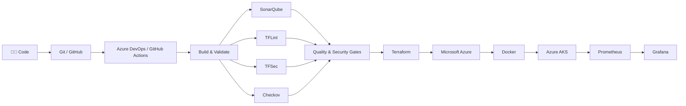

<!-- 🚀 Microsoft Azure DevOps Profile README | Priya Jaiswal -->

  

  

  
  
  
  

---

# 👋 About Me

I am **Priya Jaiswal**, an aspiring **Azure Cloud, DevOps & DevSecOps Engineer** from Lucknow, India.

I work with **Microsoft Azure, Terraform, Azure DevOps, GitHub Actions, Docker, Kubernetes (AKS), Linux, SonarQube, TFSec, TFLint, Checkov, Prometheus, and Grafana** to build automated, secure, scalable, and reliable cloud infrastructure.

- ☁️ Building cloud infrastructure on **Microsoft Azure**
- 🏗️ Automating infrastructure provisioning using **Terraform**
- ⚙️ Creating CI/CD workflows with **Azure DevOps & GitHub Actions**
- 🔐 Implementing **DevSecOps** using SonarQube, TFSec, TFLint & Checkov
- 🐳 Containerizing applications using **Docker**
- ☸️ Deploying workloads using **Kubernetes & Azure AKS**
- 📊 Monitoring infrastructure and applications with **Prometheus & Grafana**
- 🐧 Automating Linux operations using **Bash & Python**
- 🎯 Open to **Azure Cloud / DevOps / DevSecOps Engineer** opportunities

---

# 📈 Impact & Experience

| Area | Impact |
| ------------------------- | ---------------------------------------------- |
| **Terraform Automation** | Provisioned scalable Azure infrastructure using reusable modules |
| **Infrastructure Consistency** | Achieved consistent environments using modular IaC |
| **CI/CD Automation** | Automated build, validation & deployment workflows |
| **DevSecOps Integration** | Integrated SonarQube, TFSec, TFLint & Checkov into pipelines |
| **Containerization** | Optimized Docker images using multi-stage builds |
| **Kubernetes Deployment** | Deployed containerized workloads on Azure AKS |
| **Monitoring & Observability** | Built Prometheus & Grafana dashboards for AKS and system metrics |
| **Linux Automation** | Automated routine server maintenance and deployment tasks |

---

# 🧰 Tech Stack

### ☁️ Cloud

### 🏗️ Infrastructure as Code

### ⚙️ CI/CD & Automation

### 🔐 DevSecOps & Code Quality

### 🐳 Containers & Orchestration

### 📊 Monitoring & Observability

### 🐧 OS & Scripting

---

# 🔄 DevSecOps Workflow

```mermaid
flowchart LR
    A["👩‍💻 Code"] --> B["Git / GitHub"]
    B --> C["Azure DevOps / GitHub Actions"]
    C --> D["Build & Validate"]

    D --> E["SonarQube"]
    D --> F["TFLint"]
    D --> G["TFSec"]
    D --> H["Checkov"]

    E --> I["Quality & Security Gates"]
    F --> I
    G --> I
    H --> I

    I --> J["Terraform"]
    J --> K["Microsoft Azure"]

    K --> L["Docker"]
    L --> M["Azure AKS"]

    M --> N["Prometheus"]
    N --> O["Grafana"]
```

---

## 🚀 Featured Projects

<table>
<tr>
<td width="33%">

### 🚀 CI/CD Pipeline

**Azure DevOps · Terraform · Docker · NGINX**

Automated CI/CD workflows integrated with GitHub, Terraform provisioning, and Docker-based deployment on Linux servers.

</td>
<td width="33%">

### ☁️ Azure Infrastructure

**Terraform · Azure Storage · Azure Pipelines**

Reusable Terraform modules for Dev, Staging, and Production environments with remote backend and state locking.

</td>
<td width="33%">

### ☸️ AKS Deployment

**Azure AKS · Kubernetes · YAML · Git**

Provisioned AKS cluster using Terraform and created Kubernetes manifests for Pods and Deployments.

</td>
</tr>
</table>

---

## 📊 GitHub Analytics

  
  

  

---

## 🎯 Current Focus

  
  
  
  

* ☁️ Azure Cloud Infrastructure
* ⚙️ Terraform Automation
* 🔁 Azure DevOps CI/CD
* ☸️ Kubernetes & Azure AKS
* 🔐 Cloud Security, RBAC & IAM

---

## 📄 Resume

  

---

## 🤝 Connect With Me

  
  

---

  <b>⭐ Open to Azure Cloud / DevOps Engineer Opportunities ⭐</b>

  

