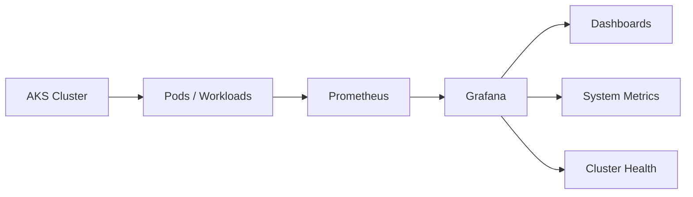

# 👋 Hi, I'm Priya Jaiswal

<p align="center">
  
</p>

<p align="center">
  <a href="https://github.com/Pjaisw1103">
    
  </a>
  <a href="https://www.linkedin.com/in/priya-jaiswal1103/">
    
  </a>
</p>

---

## 👩‍💻 About Me

I'm **Priya Jaiswal**, an aspiring **Azure Cloud & DevOps Engineer** from **Lucknow, India**, with hands-on experience in cloud infrastructure automation, CI/CD, DevSecOps, containerization, Kubernetes, and monitoring.

I enjoy building **automated, scalable, secure, and reliable cloud infrastructure** using modern DevOps practices and Infrastructure as Code.

* ☁️ Cloud infrastructure with **Microsoft Azure**
* 🏗️ Infrastructure as Code with **Terraform**
* 🔄 CI/CD automation with **Azure DevOps & GitHub Actions**
* 🔐 Shift-Left security with **SonarQube, TFSec, Checkov & TFLint**
* 🐳 Containerization with **Docker**
* ☸️ Container orchestration with **Kubernetes & Azure AKS**
* 📊 Monitoring with **Prometheus & Grafana**
* 🐧 Linux automation using **Bash & Python**
* 🎯 Open to **Azure Cloud / DevOps / DevSecOps** opportunities

---

## 🛠️ Tech Stack

### ☁️ Cloud & Infrastructure

<p>
  
  
</p>

### 🔄 CI/CD & Automation

<p>
  
  
  
  
</p>

### 🔐 DevSecOps & Code Quality

<p>
  
  
  
  
</p>

### 🐳 Containers & Kubernetes

<p>
  
  
  
</p>

### 📊 Monitoring & Scripting

<p>
  
  
  
  
  
</p>

---

## 🔄 DevOps & DevSecOps Workflow


```mermaid
flowchart LR
    A["👩‍💻 Code"] --> B["Git / GitHub"]
    B --> C["Azure DevOps"]
    C --> D["Build"]
    D --> E["SonarQube"]
    E --> F["TFSec / Checkov"]
    F --> G["TFLint"]
    G --> H["Terraform"]
    H --> I["☁️ Azure"]
    I --> J["Docker / AKS"]
    J --> K["Prometheus"]
    K --> L["Grafana"]
```

---

## 💼 Experience

### DevOps Engineer Intern

**DevOps Insiders · 2024 – 2025 · Remote**

* Provisioned scalable Azure infrastructure using modular **Terraform** scripts for consistent environments.
* Implemented secure remote Terraform state management using **Azure Blob Storage with state locking**.
* Built automated **Azure DevOps CI/CD pipelines** to eliminate manual deployment overhead.
* Integrated **SonarQube, TFSec, and Checkov** quality and security gates.
* Used **TFLint** to enforce Terraform coding standards.
* Containerized microservices using **Docker** and deployed workloads on **Azure Kubernetes Service (AKS)**.
* Optimized Docker builds and image sizes using **multi-stage builds**.
* Set up **Prometheus & Grafana** dashboards for AKS cluster health and system metrics.
* Created custom **Bash scripts** for Linux server maintenance and deployments.
* Performed **root-cause analysis** for Linux cloud-node and deployment issues.

---

# 🚀 Featured Projects

<table>
<tr>
<td width="33%" valign="top">

## 🔄 CI/CD Pipeline

**Azure DevOps · SonarQube · Checkov · Docker · NGINX**

Automated application deployment pipeline with integrated code-quality and IaC security scanning.

**Highlights**

* Azure DevOps CI/CD
* SonarQube analysis
* Checkov security scanning
* Docker containerization
* NGINX deployment

</td>

<td width="33%" valign="top">

## ☁️ Multi-Environment IaC

**Terraform · Azure Storage · TFSec · TFLint**

Reusable Terraform infrastructure for isolated **Dev, Staging & Production** environments.

**Highlights**

* Reusable Terraform modules
* Azure infrastructure
* Remote state management
* State locking
* TFSec scanning
* TFLint validation

</td>

<td width="33%" valign="top">

## ☸️ AKS Deployment

**Azure AKS · Kubernetes · Docker · Terraform · YAML**

Provisioned AKS infrastructure and deployed containerized workloads using Kubernetes manifests.

**Highlights**

* AKS provisioning
* Terraform automation
* Docker workloads
* Kubernetes Deployments
* Kubernetes Services
* Resource limits & environment variables

</td>
</tr>
</table>

---

## 🔐 DevSecOps

I follow a **Shift-Left security approach**, integrating security and quality checks into the development and deployment workflow.

```text
       CODE
         │
         ▼
      BUILD
         │
         ▼
    SonarQube
   Code Quality
         │
         ▼
 TFSec + Checkov
  Security Scan
         │
         ▼
      TFLint
 IaC Validation
         │
         ▼
     Terraform
         │
         ▼
      Azure
```

---

## 📊 Monitoring & Observability


```mermaid
flowchart LR
    A["AKS Cluster"] --> B["Pods / Workloads"]
    B --> C["Prometheus"]
    C --> D["Grafana"]
    D --> E["Dashboards"]
    D --> F["System Metrics"]
    D --> G["Cluster Health"]
```

I have worked with **Prometheus and Grafana** to provide visibility into AKS cluster health and system metrics.

---

# 📈 GitHub Analytics

<p align="center">
  
  
</p>

<p align="center">
  
</p>

---

## 🐍 Contribution Activity

<p align="center">
  
</p>

---

## 🎯 Current Focus

```text
☁️ Azure Cloud Infrastructure
🏗️ Terraform & Infrastructure as Code
🔄 Azure DevOps CI/CD
🔐 DevSecOps & Shift-Left Security
☸️ Kubernetes & Azure AKS
📊 Prometheus & Grafana
🐧 Linux & Bash Automation
🔑 Cloud Security, RBAC & IAM
```

---

## 📚 What I'm Learning

* Advanced Azure infrastructure
* Production-ready Kubernetes
* Terraform best practices
* Secure CI/CD pipelines
* DevSecOps automation
* Cloud monitoring & observability

---

## 📄 Resume

<p align="center">
  <a href="YOUR_RESUME_LINK">
    
  </a>
</p>

---

## 🤝 Let's Connect

<p align="center">

<a href="https://github.com/Pjaisw1103">

</a>

<a href="https://www.linkedin.com/in/priya-jaiswal1103/">

</a>

<a href="mailto:priyajaisw9554@gmail.com">

</a>

</p>

---

<p align="center">
  
</p>

<p align="center">
  ⭐ <b>Thanks for visiting my profile!</b> ⭐
</p>

<p align="center">
  <i>Building • Automating • Securing • Monitoring</i>
</p>
