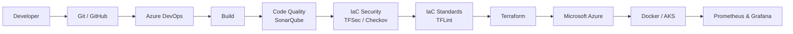
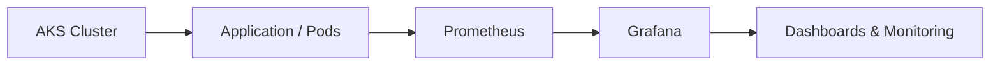

# 👋 Hi, I'm Priya Jaiswal

### ☁️ Azure Cloud | DevOps | DevSecOps | Terraform | CI/CD

I'm an aspiring **Azure Cloud & DevOps Engineer** with hands-on experience in **Azure infrastructure automation, Terraform, CI/CD, DevSecOps, Docker, Kubernetes, and monitoring**.

I enjoy building **scalable, automated, secure, and reliable cloud environments** using Infrastructure as Code and modern DevOps practices.

---

## 🚀 About Me

* ☁️ Building and automating infrastructure on **Microsoft Azure**
* 🏗️ Provisioning cloud infrastructure using **Terraform**
* 🔄 Designing CI/CD pipelines using **Azure DevOps & GitHub Actions**
* 🔐 Implementing **Shift-Left DevSecOps** using SonarQube, TFSec, Checkov & TFLint
* 🐳 Containerizing applications using **Docker**
* ☸️ Deploying and managing workloads on **Azure Kubernetes Service (AKS)**
* 📊 Monitoring Kubernetes and system health using **Prometheus & Grafana**
* 🐧 Automating Linux operations using **Bash scripting**
* 🎯 Interested in **Azure Cloud, DevOps & DevSecOps opportunities**

---

## 🧰 Technical Skills

### ☁️ Cloud

**Microsoft Azure**

### 🏗️ Infrastructure as Code

**Terraform**

### 🔄 CI/CD & Automation

**Azure DevOps · GitHub Actions**

### 🔐 DevSecOps & Code Quality

**SonarQube · TFSec · TFLint · Checkov**

### 🐳 Containers & Orchestration

**Docker · Kubernetes · Azure Kubernetes Service (AKS)**

### 📊 Monitoring & Observability

**Prometheus · Grafana**

### 🐧 Scripting & Operating Systems

**Bash · Python · Linux (Ubuntu)**

### 🔧 Version Control

**Git · GitHub**

---

## 🔄 DevOps & DevSecOps Workflow


```mermaid
flowchart LR
    A["Developer"] --> B["Git / GitHub"]

    B --> C["Azure DevOps"]

    C --> D["Build"]

    D --> E["Code Quality<br/>SonarQube"]

    E --> F["IaC Security<br/>TFSec / Checkov"]

    F --> G["IaC Standards<br/>TFLint"]

    G --> H["Terraform"]

    H --> I["Microsoft Azure"]

    I --> J["Docker / AKS"]

    J --> K["Prometheus & Grafana"]
```

---

## 💼 Experience

### DevOps Engineer Intern

**DevOps Insiders · 2024 – 2025 · Remote**

* Provisioned scalable Azure infrastructure using **modular Terraform scripts** to maintain consistent environments.
* Implemented secure **remote Terraform state management** using Azure Blob Storage with state locking.
* Built automated **Azure DevOps CI/CD pipelines** to eliminate manual deployment overhead.
* Integrated **SonarQube, TFSec, and Checkov** quality and security gates into deployment workflows.
* Used **TFLint** to enforce Terraform coding standards.
* Containerized microservices using **Docker** and deployed workloads on **Azure Kubernetes Service (AKS)**.
* Optimized Docker images using **multi-stage builds** to reduce build time and image size.
* Configured **Prometheus & Grafana** dashboards for AKS cluster health and system monitoring.
* Created custom **Bash scripts** to automate Linux server maintenance and deployments.
* Performed **root-cause analysis** to troubleshoot Linux cloud nodes and deployment issues.

---

## 🚀 Featured Projects

### 1. 🔄 CI/CD Pipeline with Code Quality & Security Scanning

**Azure DevOps · SonarQube · Checkov · Docker · NGINX**

Built an automated CI/CD workflow for application deployment with integrated code-quality and Infrastructure-as-Code security checks.

**Key Highlights:**

* ⚙️ Automated application deployment using **Azure DevOps**
* 🔍 Integrated **SonarQube** for static code analysis
* 🔐 Integrated **Checkov** for IaC security scanning
* 🐳 Containerized web applications using **Docker**
* 🌐 Deployed applications using **NGINX on Linux nodes**

---

### 2. ☁️ Multi-Environment Infrastructure Automation

**Terraform · Azure Storage · TFSec · TFLint**

Designed reusable Terraform infrastructure for isolated **Dev, Staging, and Production** environments.

**Key Highlights:**

* 🏗️ Created reusable **Terraform modules**
* ☁️ Provisioned isolated environments on **Azure**
* 🔐 Implemented remote Terraform state using **Azure Blob Storage**
* 🔒 Configured **state locking** for secure team workflows
* 🛡️ Integrated **TFSec** for IaC security analysis
* ✅ Integrated **TFLint** for Terraform code-quality checks

---

### 3. ☸️ Azure AKS Cluster Provisioning & Deployment

**Azure AKS · Kubernetes · Docker · Terraform · YAML · Git**

Provisioned Kubernetes infrastructure on Azure and deployed containerized workloads using Kubernetes manifests.

**Key Highlights:**

* ☁️ Provisioned **Azure Kubernetes Service (AKS)** using Terraform
* 🐳 Deployed containerized applications using **Docker**
* 📄 Created declarative Kubernetes **YAML manifests**
* 🚀 Managed workloads using **Deployments & Services**
* ⚙️ Configured pod **resource limits and environment variables**
* 🌐 Worked with Kubernetes cluster networking workflows

---

## 📊 Monitoring & Observability


```mermaid
flowchart LR
    A["AKS Cluster"] --> B["Application / Pods"]
    B --> C["Prometheus"]
    C --> D["Grafana"]
    D --> E["Dashboards & Monitoring"]
```

Using **Prometheus and Grafana**, I worked on monitoring:

* Kubernetes cluster health
* System metrics
* Application infrastructure
* Resource utilization
* Operational visibility

---

## 🔐 DevSecOps Approach

I believe security should be integrated into the development and deployment process rather than handled only after deployment.

```text
Code
  ↓
Build
  ↓
SonarQube
  ↓
TFSec / Checkov
  ↓
TFLint
  ↓
Terraform
  ↓
Azure
  ↓
Deployment
```

### 🛡️ Tools I Work With

| Tool          | Purpose                              |
| ------------- | ------------------------------------ |
| **SonarQube** | Static code analysis & code quality  |
| **TFSec**     | Terraform security scanning          |
| **Checkov**   | Infrastructure security scanning     |
| **TFLint**    | Terraform linting & coding standards |

---

## 🎯 Current Focus

I'm currently focusing on strengthening my skills in:

* ☁️ Azure Cloud Infrastructure
* 🏗️ Terraform & Infrastructure as Code
* 🔄 Azure DevOps CI/CD
* 🔐 DevSecOps & Shift-Left Security
* ☸️ Kubernetes & Azure AKS
* 📊 Prometheus & Grafana
* 🐧 Linux & Bash Automation
* 🔑 Cloud Security, RBAC & IAM

---

## 📈 GitHub Activity

<p align="center">
  
</p>

<p align="center">
  
</p>

---

## 📄 Resume

📌 **[View My Resume](YOUR_RESUME_LINK)**

---

## 🤝 Let's Connect

I'm open to opportunities related to:

**Azure Cloud Engineer · DevOps Engineer · DevSecOps Engineer · Cloud Engineer**

📧 **Email:** [priyajaisw9554@gmail.com](mailto:priyajaisw9554@gmail.com)
💼 **LinkedIn:** YOUR_LINKEDIN_URL
🐙 **GitHub:** YOUR_GITHUB_URL

---

### ⭐ Thanks for visiting my profile!

I'm continuously learning, building, and improving my skills in **Azure, DevOps, DevSecOps, Infrastructure as Code, and Cloud Native technologies.**
