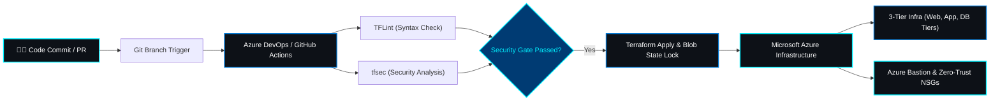

<!-- 🚀 Microsoft Azure Cloud & DevOps Engineer Profile README | Priya Jaiswal -->

  

  

  
  
  
  

---

## 📌 About Me

I am **Priya Jaiswal**, a passionate **Azure Cloud & DevOps Engineer** focused on building resilient, zero-drift cloud environments, automating multi-stage CI/CD pipelines, and embedding shift-left security standards.

#### 🎯 Engineering Focus
- ☁️ **Cloud Infrastructure:** Architecting multi-tier Azure environments (VNets, Isolated Subnets, Private VMs, Load Balancers, Azure Bastion).
- 🏗️ **Infrastructure as Code (IaC):** Authoring modular **Terraform** HCL scripts with Azure Blob distributed remote state locking for 100% environment consistency.
- ⚙️ **CI/CD & DevSecOps:** Engineering automated YAML release pipelines in **Azure DevOps & GitHub Actions** with integrated **tfsec** vulnerability analysis and **TFLint** code checks.

#### 🎓 Education & Track
- 🎓 **B.Tech in Computer Science & Engineering** | CGPA: **8.43 / 10** (*Dr. A.P.J. Abdul Kalam Technical University, 2022–2026*)
- 💼 **DevOps Engineer Intern** @ **DevOps Insiders** (*Jan 2026 – June 2026*)
- 🏆 **Focus Areas:** Zero-Trust Cloud Security, Automated Infrastructure Governance, & High-Availability Operations

 

---

## 🧰 Tech Stack & Tools

  
  
  
  
  
  
  
  

| Category | Technologies & Tools |
| :--- | :--- |
| ☁️ **Cloud Platform** | **Microsoft Azure** *(VNets, Subnets, VMs, Bastion, Storage Accounts, Load Balancer)* |
| 🏗️ **Infrastructure as Code** | **Terraform** *(Reusable Modules, Remote State Locking, Variables, Providers)* |
| ⚙️ **CI/CD & Automation** | **Azure DevOps** *(YAML Pipelines)*, **GitHub Actions**, **Git** |
| 🛡️ **DevSecOps & Quality** | **tfsec** *(Security Analysis)*, **TFLint** *(IaC Linting)* |
| 🐳 **Containers & OS** | **Docker** *(Containerization, Multi-stage Builds)*, **Linux** *(Ubuntu Administration)* |
| 🌐 **Networking & Security** | Subnets, Network Security Groups (NSGs), Ports, Inbound/Outbound Rules, SSH Keys |

---

## 💼 Work Experience

### **DevOps Engineer Intern** | **DevOps Insiders**  
*Jan 2026 – June 2026 | Remote, India*

- 🔹 **Azure Infrastructure Provisioning:** Provisioned core Azure resources (VNets, Subnets, Bastion Host, VMs, Storage Accounts, NSGs) using modular Terraform, **speeding up setup time by 15%**.
- 🔹 **Remote State Management:** Configured remote state storage on Azure Blob Storage with distributed state locking, preventing concurrent deployment conflicts across the team.
- 🔹 **Automated CI/CD Pipelines:** Engineered declarative multi-stage YAML pipelines in Azure DevOps to automate build, testing, and deployment workflows across environments.
- 🔹 **Shift-Left Security Integration:** Integrated automated security checks using **TFLint** for syntax linting and **tfsec** for pre-deployment IaC vulnerability analysis.
- 🔹 **Git Governance & Runbooks:** Managed infrastructure code repositories using Git branching workflows, enforcing PR approvals and authoring deployment runbooks for the team.
- 🔹 **System Diagnostics & RCA:** Conducted root-cause analysis (RCA) on pipeline execution failures and Linux system bottlenecks using build logs to maintain environment stability.
- 🔹 **Bash Script Automation:** Authored reusable Bash maintenance scripts on Ubuntu instances for routine environment setup, health monitoring, and system diagnostics.

---

## 🚀 Featured Projects

### 1️⃣ **Secure 3-Tier Web Application Infrastructure on Azure**
> **Stack:** `Microsoft Azure` · `Terraform` · `Azure DevOps CI/CD` · `Load Balancer` · `Azure Bastion` · `NSGs`

- **Multi-Tier IaC Architecture:** Architected and deployed a modular 3-tier infrastructure (Web, App, DB tiers) across isolated subnets using reusable Terraform scripts.
- **Zero-Trust Network Governance:** Secured traffic flow by configuring zero-trust NSG rules and Azure Bastion for private VM administration without exposing public IPs.
- **Automated Deployment & Reliability:** Built multi-stage Azure DevOps pipelines, **reducing manual deployment effort by 40%** and achieving **99% environment rollout reliability**.

---

### 2️⃣ **Automated Infrastructure CI/CD & PR Validation Pipeline**
> **Stack:** `Azure DevOps` · `GitHub Actions` · `tfsec` · `TFLint` · `YAML` · `Terraform`

- **Branch-Driven PR Validation:** Engineered a branch-driven CI/CD pipeline triggered on Pull Requests to automate Terraform validation, security scanning, and speculative plan runs.
- **Shift-Left Security Gates:** Integrated **tfsec** and **TFLint** into pipeline gates to block hardcoded credentials, open ingress ports, and non-compliant cloud configurations.
- **Multi-Stage Approval Workflows:** Implemented multi-stage approval workflows for DEV and QA environments, **reducing deployment rollback rates and speeding up PR reviews by 30%**.

---

## 🔄 DevSecOps Architecture & Deployment Workflow

```mermaid
flowchart LR
    A["👩‍💻 Code Commit / PR"] --> B["Git Branch Trigger"]
    B --> C["Azure DevOps / GitHub Actions"]
    C --> D["TFLint (Syntax Check)"]
    C --> E["tfsec (Security Analysis)"]
    D --> F{"Security Gate Passed?"}
    E --> F
    F -- Yes --> G["Terraform Apply & Blob State Lock"]
    G --> H["Microsoft Azure Infrastructure"]
    H --> I["3-Tier Infra (Web, App, DB Tiers)"]
    H --> J["Azure Bastion & Zero-Trust NSGs"]

    style A fill:#0d1117,stroke:#00f0ff,stroke-width:2px,color:#fff
    style C fill:#0d1117,stroke:#0078d4,stroke-width:2px,color:#fff
    style F fill:#003b73,stroke:#00f0ff,stroke-width:2px,color:#00f0ff
    style G fill:#0d1117,stroke:#0078d4,stroke-width:2px,color:#fff
    style H fill:#0d1117,stroke:#00f0ff,stroke-width:2px,color:#fff
    style I fill:#0d1117,stroke:#0078d4,stroke-width:2px,color:#fff
    style J fill:#0d1117,stroke:#00f0ff,stroke-width:2px,color:#fff
```

---

## 📊 GitHub Analytics

  
  &nbsp;
  

---

## ✨ Let's Connect

  
  
  

  <b>💼 Open to Azure Cloud | DevOps | DevSecOps Opportunities</b>

  

